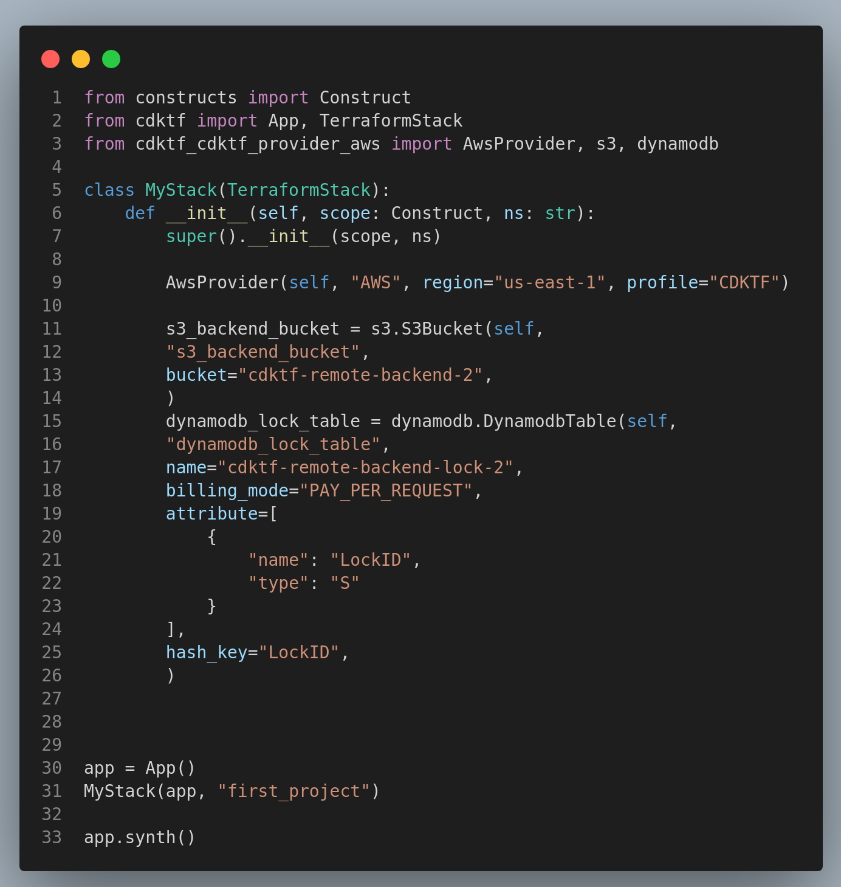

# CDK for Terraform (CDKTF) on AWS: 
## How to Configure an S3 Remote Backend and Deploy a Lambda Function URL using Python on Ubuntu 20.04 LTS

###  Table of Contents
<!-- TOC -->
- [Introduction](#introduction)
- [Step 1: Required Prerequisites](#step-1-required-prerequisites)
- [Step 2: Initializing First CDKTF Project using Python Template](#step-2-initializing-the-first-cdktf-project-using-python-template)
- [Step 3: Configuring an S3 Remote Backend](#step-3-configuring-an-s3-remote-backend)
    - [Option 1: Utilize an existing S3 bucket and DynamoDB to configure the S3 Remote Backend](#option-1-utilize-an-existing-s3-bucket-and-dynamodb-to-configure-the-s3-remote-backend)
    - [Option 2: Create an S3 Bucket and DynamoDB Table for the S3 Remote Backend using CDKTF](#option-2-create-an-s3-bucket-and-dynamodb-table-for-the-s3-remote-backend-using-cdktf)
- [Step 4: Learn How to Use Construct Hub and AWS Provider Submodules](#step-4-learn-how-to-use-construct-hub-and-aws-provider-submodules)
    - [Scenario 1: S3 Bucket](#scenario-1-s3-bucket)
    - [Scenario 2: ECS Cluster](#scenario-2-ecs-cluster)
    - [CDKTF Commands](#cdktf-commands)
- [Step 5: Deploying a Lambda Function URL using CDKTF](#step-5-deploying-a-lambda-function-url-using-cdktf)
- [Conclusion](#conclusion)
- [References](#references)
<!-- /TOC -->
---

## Introduction

After two years of collaboration between AWS and HashiCorp and on the 9th of August, 2022, AWS announced the general availability of [CDK for Terraform](https://aws.amazon.com/blogs/opensource/announcing-cdk-for-terraform-on-aws/) on AWS. As the CDKTF framework finally saw the light of day, the news triggered lots excitement among the community. The CDKTF framework is a new open-source project that enables developers to use their favorite programming languages to define and provision cloud infrastructure resources on AWS. Under the hood, it converts the programming language definitions into Terraform configuration files and uses Terraform to provision the resources. 
 
**"Learning is no longer a stage of life; it’s a lifelong journey" - Andy Bird**

It's often said that the best way to learn something new is to do it, and the first milestone in learning is often the hardest. However, with the right guidance, you can overcome the challenges and achieve your goals. My objective in this article is to guide you through the process of installing, configuring, and deploying your first AWS resource using CDKTF on AWS. In addition, I will also show you how to use the Construct Hub documentations to deploy your own AWS resources.

The tutorial should be easy to follow and understand for beginners and intermediate users. The tutorial is devoted to developers with adequate AWS, Terraform and Python knowledge but who are unsure of how and where to begin their CDKTF learning. 

The main topics covered in this tutorial are:

1. Proper installation and configuration of all required prerequisites.
2. Installing and configuring CDKTF.
3. Initializing first CDKTF project using Python template and local backend.
4. Deploying a S3 bucket and DynamoDB table and configuring an S3 remote backend.
5. Learning how to read/use AWS Provider Submodules and Construct Hub documentations
6. Provisioning an S3 Bucket using CDKTF
7. Provisioning an IAM role and Lambda Function URL using CDKTF

This tutorial is also available on my GitHub - [CDKTF-Tutorial](https://github.com/OmarCloud20/CDKTF-Tutorial) repo. By the end of this tutorial, you shall be comfortable deploying AWS resources using the CDKTF framework. I will pass you the learning baton and you can take it from there.
Enough said, let's get started.

---


## Step 1: Required Prerequisites  

To complete this tutorial successfully, we should install and configure the following prerequisites properly. To set you up for success, I have to ensure you have the following prerequisites installed and configured properly:


1. AWS CLI version 2: 

- Follow AWS [Prerequisites to use the AWS CLI version 2](https://docs.aws.amazon.com/cli/latest/userguide/getting-started-prereqs.html) documentation for all required prerequisites.
- Follow [Installing or updating the latest version of the AWS CLI](https://docs.aws.amazon.com/cli/latest/userguide/getting-started-install.html) document to install the AWS CLI v2 as per your local device architecture. In my case, it's an Ubuntu 20.04 LTS OS running on a Linux x86 (64-bit) architecture. 
- Lastly, follow the [Configuration basics - Profiles](https://docs.aws.amazon.com/cli/latest/userguide/cli-configure-quickstart.html#:~:text=as%20programmatically%20useful.-,Profiles,-A%20collection%20of) document to configure the AWS CLI v2 and create a `named profile` (name it CDKFT as shown below). We will use the named profile to configure AWS Provider credentials later on.  

```
aws configure --profile CDKTF
```

>Note: the profile name does not have to be CDKTF, you can name it however you like. However, I will be using CDKTF in this tutorial.


3. [Terraform](https://learn.hashicorp.com/tutorials/terraform/install-cli) (version v1.0+ as per Terraform's recommendation).
4. Node.js and npm v16+:

- Follow [NodeSource Node.js Binary Distributions](https://github.com/nodesource/distributions/blob/master/README.md#:~:text=install%20%2Dy%20nodejs-,Node.js%20v16.x%3A,-%23%20Using%20Ubuntu) to install Node.js v16.x for Ubuntu (the installation includes npm). For other operating systems and architectures, refer to [Node.js](https://nodejs.org/en/) official page. Once you have Node.js installed, make sure it's version 16.x by running the below command:

```
node -v
```

5. Python 3.7+: Ubuntu 20.04 LTS distribution comes with [Python 3.8.2](https://packages.ubuntu.com/search?keywords=python3&searchon=names&suite=focal&section=all) pre-installed by default. Run the below command to confirm:

```
python3 --version
```

Additionally, we will need to make sure we have `pip` installed and available. 

```
pip3 --version
```

>Note: if `pip` is unavailable, run `sudo apt install python3-pip` to install it as per [Python](https://packaging.python.org/en/latest/guides/installing-using-linux-tools/#debian-ubuntu) documentation.

6. [pipenv](https://pypi.org/project/pipenv/) v2021.5.29+: as of Sep 22, 2022, the latest version of `pipenv` is 2022.9.20. We will use `pip` to install `pipenv`. 

```
pip3 install pipenv
```

>Note: if you receive a `WARNING` stating `pipenv` is not installed on `PATH` as shown on the below image, run the below command to add it to the path:

```
export PATH="the-path-mentioned-in-the-warning:$PATH"
```

Actual example:

```
export PATH="/home/CDKTF/.local/bin:$PATH"
```


We have to confirm that `pipenv` is installed and available before we proceed. Run the below command to confirm:


```
pipenv --version
```

>Note: it's tempting to install `pipenv` by using the package manager `sudo apt install pipenv`, but be aware that the system repository version of `pipenv` is outdated and will not work with the CDKTF framework.


7. CDKFT: now, we are ready to install the latest stable release of `CDKTF` using `npm`:

```
npm install --global cdktf-cli@latest
```

If you receive a permission denied error, use `sudo` as shown below:

```
sudo npm install --global cdktf-cli@latest
```
Let's confirm the version:

```
cdktf --version
```

**Make sure you have all required prerequisite versions installed and configured successfully as shown on the below image:**


Reaching this point means you have all required prerequisites installed and configured properly. We are ready to move on to the next step. This is a milestone, so take a moment to celebrate it. You deserve it.


---


## Step 2: Initializing the First CDKTF Project using Python Template


In this section, we will learn how to use `CDKTF` commands to create our first AWS CDKTF Python project. We will use the `cdktf init` command to create a new project in the current directory. The command also creates a `cdktf.json` file that contains the project configuration. The `cdktf.json` file contains the project name, the programming language, and the Terraform provider. The `cdktf.json` file is used by the `cdktf` command to determine the project configuration. Follow the below steps to initialize the first CDKTF project using Python template:


1. Create a new directory for the project and `cd` into the directory. I will create a directory on my Desktop and name it `first_project`:


```
mkdir first_project && cd first_project
```

2. Run the following command to initialize our first CDKTF project. We will be promoted to enter the following information:

A. Name of the project: leave it as `first_project` and hit `Enter`.

B. Project description: leave it as `My first CDKTF project` and hit `Enter`.

C. Send crash reports to CDKTF team. I would highly recommend you say `yes` to send crash reports to the CDKTF team. This will help improve the product and fix bugs. 


```
cdktf init --template="python" --local
```

>Note 1: we are using the `--local` flag to store our Terraform state file locally. We will reconfigure the backend to S3 Remote backend in the next section.


>Note 2: if you receive error `[ModuleNotFoundError: No module named 'virtualenv.seed.via_app_data']`, you would need to remove `virtualenv` by running `sudo apt remove  python3-virtualenv`. We should still have `virtualenv` as part of the pip packages. Run `pip3 show virtualenv` to confirm. If you don't see `virtualenv` in the list, run `pip3 install virtualenv` to install it.


3. Activate the project's virtual environment (optional but recommended):

```
pipenv shell
```


>Note: the purpose of creating a virtual environment is to isolate the project and and all its packages and dependencies from the host or local device. It's a self contained environment within the host to prevent polluting the system. It's highly recommended to activate it to keep your host healthy and clean. 

4. Install AWS provider. There are multiple ways to install [AWS Provider](https://constructs.dev/packages/@cdktf/provider-aws/v/9.0.36?lang=python). We will use `pipenv` to install the AWS provider. Run the below command to install the AWS provider:

```
pipenv install cdktf-cdktf-provider-aws
```


>Note: as of the 26th of Sep, 2022, if you decide to install the AWS Provider using `cdktf provider add "aws@~>4.0"`, the installation will fail due to [no matching distribution found for version v9.0.36](https://github.com/hashicorp/cdktf-provider-aws/issues/749). There are other methods of importing a provider but this tutorial won't discuss to focus on simplicity. 

---

[](https://asciinema.org/a/523196)


Congratulations, you have successfully initialized your first CDKTF Python project. This is another milestone to celebrate. Get a cup of coffee ☕️ and let's move on to the next section.

---


## Step 3: Configuring an S3 Remote Backend

Terraform stores all managed infrastructure and configuration by default in a file named `terraform.tfstate`. If a local backend is configured for the project, the state file is stored in the current working directly. However, when working in a team environment to collaborate with other team members, it is important to configure a remote backend. There are several remote backend options such as, consul, etcd, gcs, http and s3. For a full list of remote backends, refer to [Terraform](https://www.terraform.io/language/settings/backends/configuration#available-backends) documentation. 

For this tutorial, we will configure an [S3 Remote Backend](https://www.terraform.io/language/settings/backends/s3) which includes an S3 bucket for storing the state file and a DynamoDB table for state locking and consistency checking. 

**Select one of the following options to configure the S3 Remote Backend:**


### Option 1: Utilize an existing S3 bucket and DynamoDB to configure the S3 Remote Backend. 

1. From Step 2, while we still have the virtual environment activated, let's open the project directory using our choice of an Integrated Development Environment (IDE). In my case, I'm using [Visual Studios Code](https://code.visualstudio.com/) which I downloaded from the `Ubuntu Software Store`. Run `code .` on the terminal to open the project directory via VS Code.

2. Navigate to `main.py` file and add the AWS provider construct to the imports section:

```
from cdktf_cdktf_provider_aws import AwsProvider
```
>Note: the final `main.py` code will be provided at the end of this section.


3. Configure the AWS provider by adding the following code to `MyStack` class:


```
AwsProvider(self, "AWS", region="us-east-1", profile="CDKTF")
```

>Note: we are using the `profile` attribute to specify the AWS profile to use. This is the AWS CLI profile we have previously discussed and created in the [Required Prerequisites](#step-1-required-prerequisites) section. If you don't have a profile created, you can remove the `profile` attribute and the AWS provider will use the default profile. Or, you can use a different authentication method as per the [AWS Provider](https://registry.terraform.io/providers/hashicorp/aws/latest/docs) documentation.

4. Add `S3Backend` class to the other imported classes. The S3Backend class is employing the S3 bucket and DynamoDB table as an S3 remote backend.

```
from cdktf import App, TerraformStack, S3Backend
```

5. Add the S3 Backend construct to the `main.py` file. We will add the following S3 Backend configurations to the `MyStack` class:

- `bucket` - the name of the S3 bucket to store the state file. The bucket must exist and be in the same region as the stack. If the bucket doesn't exist, the stack will fail to deploy.

- `key` - the name of the state file and its path. The default value is `terraform.tfstate`.

- `encrypt` - whether to encrypt the state file using server-side encryption with AWS KMS. The default value is `true`.

- `region` - the region of the S3 bucket and DynamoDB table. The default value is `us-east-1`.

- `dynamodb_table` - the name of the DynamoDB table to use for state locking and consistency checking. The table must exist and be in the same region as the stack. If the table doesn't exist, the stack will fail to deploy.

- `profile` - the AWS CLI profile to use. The default value is `default`. But, we have already configured the AWS provider to use the `CDKTF` profile. 

Here is how the S3 Backend construct will look like:

```
        S3Backend(self,
        bucket="cdktf-remote-backend",
        key="first_project/terraform.tfstate",
        encrypt=True,
        region="us-east-1",
        dynamodb_table="cdktf-remote-backend-lock",
        profile="CDKTF",
        )
```

The final `main.py` file should look like this:

```
from constructs import Construct
from cdktf import App, TerraformStack, S3Backend
from cdktf_cdktf_provider_aws import AwsProvider

class MyStack(TerraformStack):
    def __init__(self, scope: Construct, ns: str):
        super().__init__(scope, ns)

        AwsProvider(self, "AWS", region="us-east-1", profile="CDKTF")
        
        S3Backend(self,
        bucket="cdktf-remote-backend",
        key="first_project/terraform.tfstate",
        encrypt=True,
        region="us-east-1",
        dynamodb_table="cdktf-remote-backend-lock",
        profile="CDKTF",
        )

        # define resources here


app = App()
MyStack(app, "first_project")

app.synth()
```


6. Run `cdktf synth` to generate the Terraform configuration files. The Terraform configuration files will be generated in the `cdktf.out` directory. The `synth` command will fail if the S3 bucket and DynamoDB table don't exist. 


```
cdktf synth
```

You have successfully configured the S3 Remote Backend. Let's move on to the next section.


7. To test the configuration of the S3 remote backend, follow the below steps to create an S3 bucket resource and deploy the stack. 

- Import the S3 bucket library to the `main.py` file:

```
from cdktf_cdktf_provider_aws import AwsProvider, s3
```

- Add the S3 bucket resource to the `MyStack` class:

```
        my_bucket = s3.S3Bucket(self, "my_bucket",
        bucket="Name-of-the-bucket",
        )
``` 

- Replace `Name-of-the-bucket` with the name of the bucket you want to create. Note, S3 bucket names must be unique across all existing bucket names in Amazon S3.


- Run `cdktf deploy` to deploy the stack and create the S3 bucket. 


```
cdktf deploy
```


[](https://asciinema.org/a/523571)

>Note: if you get `Incomplete lock file information for providers` warning, you can either ignore it or you can run `terraform providers lock -platform=linux_amd64` from the project root directory to validate the lock file. For more information, refer to [Terraform](https://www.terraform.io/docs/language/providers/requirements.html#provider-locks) documentation.


Congratulations, you have successfully configured an S3 remote backend and created an S3 bucket using CDKTF. It's time to take a break and stretch your legs. 

---

### Option 2: Create an S3 Bucket and DynamoDB Table for the S3 Remote Backend using CDKTF

For this option, we will take a different approach. We will create the S3 bucket and DynamoDB table using CDKTF and then configure the S3 remote backend to use the newly created resources. Follow the below steps to create the S3 bucket and DynamoDB table:


1. Open the project directory using your preferred IDE. If you are using VS Code, `cd` into the project folder and run `code .` on the terminal to open the project directory using VS Code. 

2. Navigate to the `main.py` file and replace the default code with the following. This code creates an S3 bucket and DynamoDB table for the S3 remote backend. 


```
from constructs import Construct
from cdktf import App, TerraformStack, S3Backend
from cdktf_cdktf_provider_aws import AwsProvider, s3, dynamodb

class MyStack(TerraformStack):
    def __init__(self, scope: Construct, ns: str):
        super().__init__(scope, ns)

        AwsProvider(self, "AWS", region="us-east-1", profile="CDKTF")

        # define resources here
        s3_backend_bucket = s3.S3Bucket(self,
        "s3_backend_bucket",
        bucket="cdktf-remote-backend-2",
        )
        dynamodb_lock_table = dynamodb.DynamodbTable(self, 
        "dynamodb_lock_table",
        name="cdktf-remote-backend-lock-2",
        billing_mode="PAY_PER_REQUEST",
        attribute=[
            {
                "name": "LockID",
                "type": "S"
            }
        ],
        hash_key="LockID",
        )


app = App()
MyStack(app, "first_project")

app.synth()
```


>Note, if the S3 bucket and DynamoDB table already exist, an error will be thrown. The S3 bucket names must be globally unique across all existing bucket names in Amazon S3 and DynamoDB table names must be unique within an AWS account. If you get an error, you can change the bucket and table names to unique names.





3. Run `cdktf deploy` to deploy the stack and create the S3 bucket and DynamoDB table.

```
cdktf deploy
```

[](https://asciinema.org/a/523572)

>Note: if you get `Incomplete lock file information for providers` warning, you can either ignore it or you can run `terraform providers lock -platform=linux_amd64` from the project root directory to validate the lock file. 


4. Now, we will configure the S3 remote backend to use the newly created S3 bucket and DynamoDB table. Open the `main.py` file and replace the code with the following. This code configures the S3 remote backend to use the newly created S3 bucket and DynamoDB table. Make sure to replace the `bucket` and `dynamodb_table` values with the names of the S3 bucket and DynamoDB table you created in the previous step.


```
from constructs import Construct
from cdktf import App, TerraformStack, S3Backend
from cdktf_cdktf_provider_aws import AwsProvider, s3, dynamodb

class MyStack(TerraformStack):
    def __init__(self, scope: Construct, ns: str):
        super().__init__(scope, ns)

        AwsProvider(self, "AWS", region="us-east-1", profile="CDKTF")

        #S3 Remote Backend
        S3Backend(self,
        bucket="cdktf-remote-backend-2",
        key="first_project/terraform.tfstate",
        encrypt=True,
        region="us-east-1",
        dynamodb_table="cdktf-remote-backend-lock-2",
        profile="CDKTF",
        )

        # Resources
        s3_backend_bucket = s3.S3Bucket(self, "s3_backend_bucket",
        bucket="cdktf-remote-backend-2",
        )

        dynamodb_lock_table = dynamodb.DynamodbTable(self, "dynamodb_lock_table",
        name="cdktf-remote-backend-lock-2",
        billing_mode="PAY_PER_REQUEST",
        attribute=[
            {
                "name": "LockID",
                "type": "S"
            }
        ],
        hash_key="LockID",
        )


app = App()
MyStack(app, "first_project")

app.synth()
```

5. Run `cdktf synth` to generate the Terraform configuration files. The Terraform configuration files will be generated in the `cdktf.out` directory.


```
cdktf synth
```

6. To migrate the local state backend to an S3 remote backend, navigate to the `cdktf.out/stacks/first_project` directory and run the following command to start the migration process. The `first_project` is the name of the project. If you have named your project differently, navigate to the `cdktf.out/stacks/<project_name>` directory and run the command.


 **Note: before running this command, read Important Notes below**

```
cd cdktf.out/stacks/first_project
```

```
terraform init --migrate-state
```


**Important Notes:**

When you run `terraform init --migrate-state`, Terraform prompts you to answer the following question:

`Do you want to copy existing state to the new backend?`


A. If you enter, `yes` to migrate the state file to the S3 backend, CDKTF will manage the S3 remote backend (S3 bucket and DynamoDB table) for you. Therefore, if you delete the stack, the S3 bucket and DynamoDB table will be vurnerable to deletion. Note, we can't delete a non-empty S3 unless we add `force_destroy=True` to the S3 bucket configuration. This option is not recommended if you want to keep the S3 bucket and DynamoDB table, especially if you are using the S3 bucket and DynamoDB table as a remote backend for other Terraform projects. But, if you are just experimenting with CDKTF, this option is fine.

B. If you enter `no`, to migrate the state file to the S3 backend, CDKTF will not manage the S3 bucket and DynamoDB table. If you delete the stack, the S3 bucket and DynamoDB table will not be deleted and you will have to manually delete the S3 bucket and DynamoDB table. Moreover, you will also need to remove the S3 bucket and DynamoDB table constructs from the `main.py` file. 

To read more about initializing remote backend manually, refer to the [Terraform documentation](https://www.terraform.io/cdktf/concepts/remote-backends#:~:text=All%20cdktf%20operations%20perform%20an%20automatic%20terraform%20init%2C%20but%20you%20can%20also%20initialize%20manually).


The below terminal recording demonstrates the steps above. In the recording, I have shown the error message that you may get if you attempt to run `cdktf deploy` prior to reconfiguring from local backend to an S3 remote backend. 
I have entered `yes` to migrate the state file to the S3 remote backend and let the CDKTF manage the S3 bucket and DynamoDB table. 

[](https://asciinema.org/a/523574)


7. Run `cdktf diff` from the project root directory to compare the current state of the stack with the desired state of the stack. The output should be empty, which means there are no changes to be made and the state file is up to date.


```
cdktf diff
```


Great! You have successfully migrated the local state backend to an S3 remote backend. Way to go, you have achieved another milestone! 🎉🎉🎉


---


## Step 4: Learn How to Use Construct Hub and AWS Provider Submodules

Prior to digging into the AWS provider, let's first understand most commonly used terms in the CDKTF documentation:

1. Submodules is a collection of related resources. For example, the `s3.S3Bucket` construct is part of the `s3` submodule. The `s3.S3Bucket` construct creates an S3 bucket. The `s3` submodule contains other constructs such as `s3.S3BucketPolicy`, `s3.S3BucketAcl`, `s3.S3BucketObject`, etc.

2. [Construct](https://developer.hashicorp.com/terraform/cdktf/concepts/constructs) is another important term to understand. A construct is a class that represents a Terraform resource, data source, or provider. The `s3` submodule contains constructs that represent S3 constructs, classes and struts. 

3. Stack is a collection of constructs. The `MyStack` class in the `main.py` file is a stack. The `MyStack` class contains constructs that represent S3 constructs, classes and struts. 

---


### Scenario 1: S3 Bucket

Let's say we would like to create an S3 but we don't know which construct to use. Let's head to the Python [Construct hub](https://constructs.dev/packages/@cdktf/provider-aws/v/9.0.33?lang=python) for the AWS provider and follow the steps below:

1. From the left hand side and under **Documentation**, click on **Choose Submodule**. 
2. In the search box, type in **s3** and then click on the result, which is **s3**. 
3. Under **Submodule:s3**, you will see a list of **Constructs** and **Struts**. Click on **S3Bucket**
4. To create an S3 bucket, you will import the **s3** class as shown under `Initializers`.
5. The construct to use is `s3.S3Bucket`. 
6. We need to find the required configurations for the `s3.S3Bucket` construct. Scan the page and look for configurations marked `Required`. In this case, S3 bucket does not have any required configuration, not even a name. If you leave the name argument empty, the S3 bucket will be created with a random name. We can specify a name for the S3 bucket and other configurations, but this is not required. 

We have to distinguish between required and optional configurations. Required configurations must be specified when creating a resource. Optional configurations can be specified when creating a resource.

This is the code snippet for creating an S3 bucket with minimal configurations:

```
my_3bucket= s3.S3Bucket(self, "s3_bucket")
```

>Note: the name of the S3 bucket is not specified. If you leave the name argument empty, the S3 bucket will be created with a random name.

---

### Scenario 2: ECS Cluster

This time let's say we would like to create an ECS cluster. Let's head to the Python [Construct hub](https://constructs.dev/packages/@cdktf/provider-aws/v/9.0.33?lang=python) for the AWS provider and follow the steps below:

1. From the left hand side and under **Documentation**, click on **Choose Submodule**.
2. In the search box, type in **ecs** and then click on the result, which is **ecs**.
3. Under **Submodule:ecs**, you will see a list of **Constructs** and **Struts**. Click on **EcsCluster**
4. To create an ECS cluster, you will import **ecs** class as shown under `Initializers`.
5. The construct to use is `ecs.EcsCluster` as shown below.
6. We need to find the required configurations for the `ecs.EcsCluster` construct. The minimum required configurations to create an ECS cluster is just the `name` of the cluster. But, we can also specify other configurations such as, `capacity_providers`, `default_capacity_provider_strategy`, `configuration`, etc. 

```
my_ecs_cluster = ecs.EcsCluster(self, "my_ecs_cluster",
name = "My_Cluster"
)
```


---

### CDKTF Commands:


There are several [CDKTF commands](https://developer.hashicorp.com/terraform/cdktf/cli-reference/commands) that we need to be familiar with. The below table shows the commands, their descriptions and the corresponding Terraform commands.

| **Commands**      | **Description**                                                                                            | **Aliases**           | 
| :---------------- | :--------------------------------------------------------------------------------------------------------- | :-------------------- |
| cdktf init        | Create a new cdktf project from a template.                                                                |                       | 
| cdktf get         | Generate CDK Constructs for Terraform providers and modules.                                               |                       | 
| cdktf convert     | Converts a single file of HCL configuration to CDK for Terraform. Takes the file to be converted on stdin. |                       | 
| cdktf deploy      | Deploy the given stacks                                                                                    | [aliases: apply]      | 
| cdktf destroy     | Destroy the given stacks                                                                                   |                       | 
| cdktf diff        | Perform a diff (terraform plan) for the given stack                                                        | [aliases: plan]       | 
| cdktf list        | List stacks in app.                                                                                        |                       | 
| cdktf login       | Retrieves an API token to connect to Terraform Cloud or Terraform Enterprise.                              |                       | 
| cdktf synth       | Synthesizes Terraform code for the given app in a directory.                                               | [aliases: synthesize] | 
| cdktf watch       | [experimental] Watch for file changes and automatically trigger a deploy                                   |                       | 
| cdktf output      | Prints the output of stacks                                                                                | [aliases: outputs]    | 
| cdktf debug       | Get debug information about the current project and environment                                            |                       | 
| cdktf provider    | A set of subcommands that facilitates provider management                                                  |                       | 
| cdktf completion  | generate completion script                                                                                 |                       | 


To find out more about the `cdktf` commands, run `cdktf [command] --help` and replace `[command]` with the command you want to learn more about. 

For example, to learn more about the `cdktf deploy` command, run `cdktf deploy --help`.


---


## Step 5: Deploying a Lambda Function URL using CDKTF

CDKTF is a great tool to provision AWS resources. We have already created an S3 bucket and DynamoDB table in the previous section. In this section, I will show you how to create a Lambda function using CDKTF with function url enabled. The lambda will host a simple static web page, and well configure the function url as an output. The process requires creating an IAM role and attaching a policy to the role. I will also introduce you to multiple concepts in CDKTF. 

In this section, I will cover the following topics:


- How to create an IAM role for Lambda function
- How to attach a policy to the IAM role
- How to create a Lambda function
- How to enable function url for the Lambda function
- How to package a Lambda function from a local directory and python file
- How to create an output for the Lambda function url


Buckle up, we are going to learn a lot in this section! 🚀🚀🚀

<br> 


**Follow the steps below to deploy a Lambda function URL using CDKTF:**


1. Firstly, let's keep out project organized and create a new directory called `lambda` in the root directory of the project. This is where we will store our Lambda function code. 

2. Create a new file called `lambda_function.py` in the `lambda` directory.

3. Copy the `lambda_function.py` code from my [GitHub repository](https://raw.githubusercontent.com/OmarCloud20/CDKTF-Tutorial/main/lambda/lambda_function.py) and paste it into the `lambda_function.py` file.

4. I go over the `main.py` code and the final `main.py` file will provided at the end of the section. 

- In the `main.py` file, import the `TerraformOutput`, `TerraformAsset` and `AssetType` classes from the `cdktf` module. [Assets](https://developer.hashicorp.com/terraform/cdktf/concepts/assets) construct is introduced in CDK for Terraform v0.4+ and is used to package a local directory and python file into a zip file. The `TerraformOutput` construct is used to create an output for the Lambda function url. The `AssetType` is used to specify the type of asset. 

The final import statements should look like this:

```
from constructs import Construct
from cdktf import App, TerraformStack, S3Backend, TerraformOutput, TerraformAsset, AssetType
from cdktf_cdktf_provider_aws import AwsProvider, s3, dynamodb, iam, lambdafunction
import os
import os.path as Path
```
>Note, we have imported `os` and `os.path as Path` modules. We will use these modules to get the current working directory and to join the path to the lambda directory.

- The `TerraformAsset` construct requires a `path` argument. The `path` argument is the path to the directory or file that you want to package. In this case, we will use the `os` module to get the current working directory and then join the path to the `lambda` directory. The `AssetType.ARCHIVE` is to specify that the asset is an archive. The final `path` argument should look like this:


```
asset = TerraformAsset(self, "lambda_file",
path = Path.join(os.getcwd(), "lambda"),
type = AssetType.ARCHIVE,
)
```

- Creating a Lambda function requires creating an IAM role. Therefore, we will create an IAM role first. We will also attach the `AWSLambdaBasicExecutionRole` AWS managed policy to the IAM role. This policy allows the Lambda function to write logs to CloudWatch. Refer to AWS documentation for more information about the [AWSLambdaBasicExecutionRole](https://docs.aws.amazon.com/lambda/latest/dg/lambda-intro-execution-role.html#:~:text=June%2017%2C%202022-,AWSLambdaBasicExecutionRole,-%E2%80%93%20Lambda%20started%20tracking) policy.

The `assume_role_policy` argument is the policy that grants permission to assume the IAM role, which requires a JSON string. The JSON string is the policy document that grants permission to assume the IAM role. The final snippet of code should look like this:

```
        lambda_role = iam.IamRole(self, "lambda_role",
        name="my-lambda-url-role",
        managed_policy_arns=[
            "arn:aws:iam::aws:policy/service-role/AWSLambdaBasicExecutionRole"
        ],
        assume_role_policy="""{
            "Version": "2012-10-17",
            "Statement": [
                {
                    "Action": "sts:AssumeRole",
                    "Principal": {
                        "Service": "lambda.amazonaws.com"
                    },
                    "Effect": "Allow",
                    "Sid": ""
                }
            ]
        }""",
        )

```

- Now, we are ready to create a lambda function. The `handler` configuration is the name of the python file that contains the lambda function. The `runtime` provides a language-specific environment that runs in an execution environment. The `source_code_hash` argument is the hash of the file that contains the lambda function. The `source_code_hash` argument is required to trigger a new deployment when the lambda function code changes. The `filename` argument is the path to the file that contains the lambda function.


 The final snippet of code should look like this:


```
        my_lambda = lambdafunction.LambdaFunction(self, "my_lambda",
        function_name="my-lambda-url",
        handler="lambda_function.lambda_handler",
        role=lambda_role.arn,
        runtime="python3.9",
        source_code_hash = asset.asset_hash,
        filename=asset.path,
        )
```

- We need to enable function url for the lambda function and define an `authorization_type` for the function url. The `authorization_type` argument is the type of authorization that is used to invoke the function url. The `authorization_type` argument can be set to `NONE` or `AWS_IAM`. The final snippet of code should look like this:

```
        my_lambda_url = lambdafunction.LambdaFunctionUrl(self, "my_lambda_url",
        function_name=my_lambda.function_name,
        authorization_type="NONE",
        )
```

- Finally, we need to create an output for the Lambda function url. The `value` argument is the value of the output. The `value` argument can be a string, number, boolean, or a list. The final snippet of code should look like this:

```
        TerraformOutput(self, "lambda_url",
        value=my_lambda_url.invoke_url,
        )
```

<br>

**The final `main.py` code should look like this:**

```
from constructs import Construct
from cdktf import App, TerraformStack, S3Backend, TerraformOutput, TerraformAsset, AssetType
from cdktf_cdktf_provider_aws import AwsProvider, s3, dynamodb, iam, lambdafunction
import os
import os.path as Path

class MyStack(TerraformStack):
    def __init__(self, scope: Construct, ns: str):
        super().__init__(scope, ns)

        AwsProvider(self, "AWS", region="us-east-1", profile="CDKTF")

        #S3 Remote Backend
        S3Backend(self,
        bucket="cdktf-remote-backend-2",
        key="first_project/terraform.tfstate",
        encrypt=True,
        region="us-east-1",
        dynamodb_table="cdktf-remote-backend-lock-2",
        profile="CDKTF",
        )

        # Resources
        s3_backend_bucket = s3.S3Bucket(self, "s3_backend_bucket",
        bucket="cdktf-remote-backend-2",
        )

        dynamodb_lock_table = dynamodb.DynamodbTable(self, "dynamodb_lock_table",
        name="cdktf-remote-backend-lock-2",
        billing_mode="PAY_PER_REQUEST",
        attribute=[
            {
                "name": "LockID",
                "type": "S"
            }
        ],
        hash_key="LockID",
        )

        # Asset for Lambda Function
        asset = TerraformAsset(self, "lambda_file",
        path = Path.join(os.getcwd(), "lambda"),
        type = AssetType.ARCHIVE,
        )

        # IAM Role for Lambda Function
        lambda_role = iam.IamRole(self, "lambda_role",
        name="my-lambda-url-role",
        managed_policy_arns=[
            "arn:aws:iam::aws:policy/service-role/AWSLambdaBasicExecutionRole"
        ],
        assume_role_policy="""{
            "Version": "2012-10-17",
            "Statement": [
                {
                    "Action": "sts:AssumeRole",
                    "Principal": {
                        "Service": "lambda.amazonaws.com"
                    },
                    "Effect": "Allow",
                    "Sid": ""
                }
            ]
        }""",
        )
        
        # Lambda Function
        my_lambda = lambdafunction.LambdaFunction(self, "my_lambda",
        function_name="my-lambda-url",
        handler="lambda_function.lambda_handler",
        role=lambda_role.arn,
        runtime="python3.9",
        source_code_hash = asset.asset_hash,
        filename=asset.path,
        )
        
        # Lambda Function Url
        my_lambda_url = lambdafunction.LambdaFunctionUrl(self, "my_lambda_url",
        function_name=my_lambda.function_name,
        authorization_type="NONE",
        )
        
        

        # Outputs for Lambda Function Url
        TerraformOutput(self, "lambda_url",
        value=my_lambda_url.function_url,
        )


app = App()
MyStack(app, "first_project")

app.synth()
```

5. Run `cdktf deploy` to deploy the stack. 
```
cdktf deploy
```

>Note: you can also run `cdktf deploy --auto-approve` to deploy the stack without confirmation. However, refrain from using this option in production.

<br>

Congratulations! You have successfully deployed a lambda function with a function url using CDKTF. You can copy the function url from the output and paste it in your browser to invoke the lambda function. 

---


**To delete the stack, we need to follow the below steps:**

Note, we chose to allow CDKTF to manage the remote backend. This means that CDKTF will delete the remote backend (the S3 bucket and DynamoDB Table) when we delete the stack. There are many methods to delete the stack, but I find the below method to be the easiest. Let's go through the steps:


A. Add `force_destroy=True` to the `s3_backend_bucket` configurations. The S3 bucket cannot be deleted if it is not empty. This is the reason why we need to add `force_destroy=True`.

```
        s3_backend_bucket = s3.S3Bucket(self, "s3_backend_bucket",
        bucket="cdktf-remote-backend-2",
        force_destroy=True
        )
```

B. Run `cdktf deploy` to update the S3 bucket configurations. 

C. Run `cdktf destroy` to delete the entire stack.

```
cdktf destroy
```

>Note: after running `cdktf destroy`, you will get an error message saying `failed to retrieve lock info`. This is expected due to the fact the dynamodb table is deleted. You can ignore this error message.

---

<br>


## Conclusion

In this tutorial, we have learned how to properly install and configure CDKTF, how to migrate from a local backend to an S3 remote backend. We have also learned how to deploy a lambda function with a function url using CDKTF; in addition, to learning how to read and utilize the CDKTF documentation from the Construct Hub.

Congratulations on completing this tutorial, overcoming these challenges and achieving many learning milestones. I hope you enjoyed this tutorial, and it added value to your learning journey. Thank you for reading!


